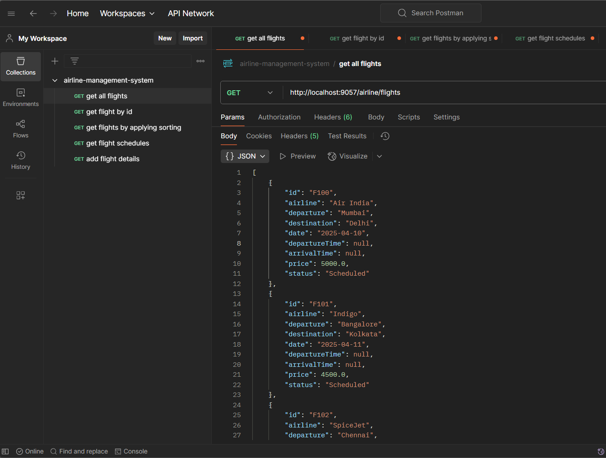
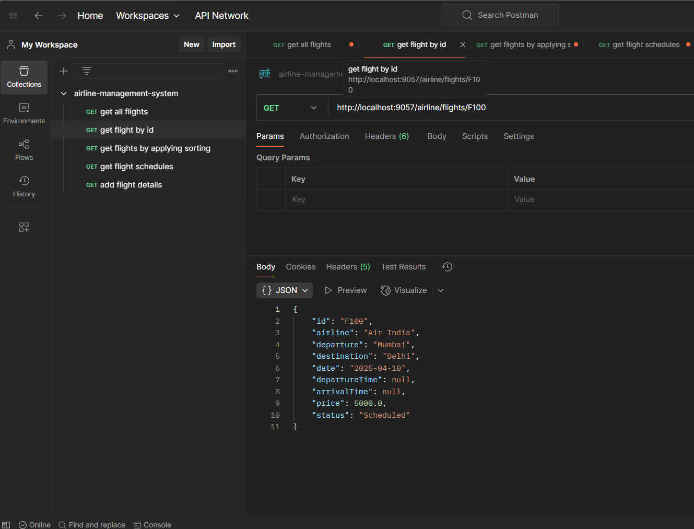
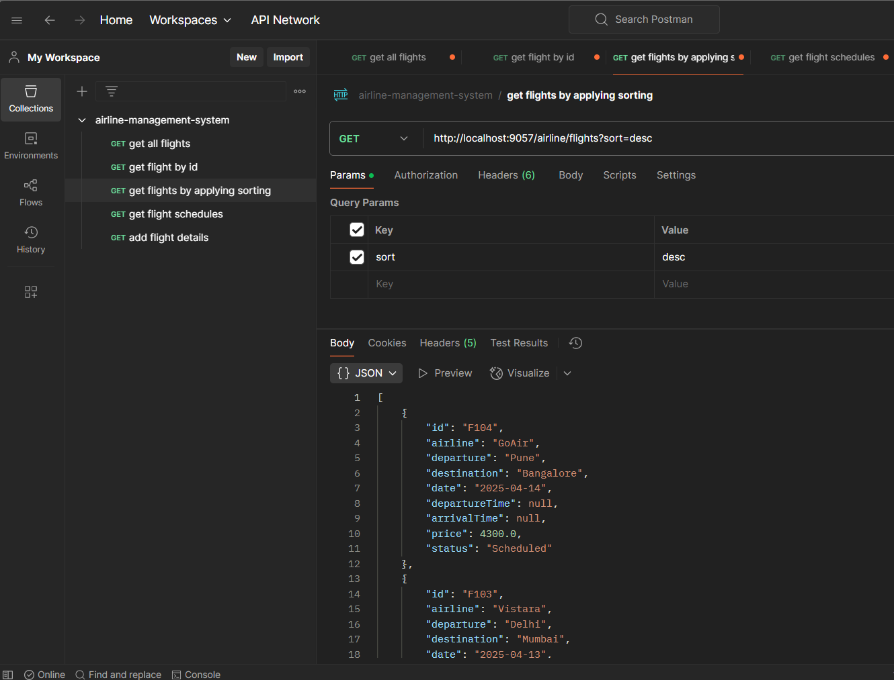
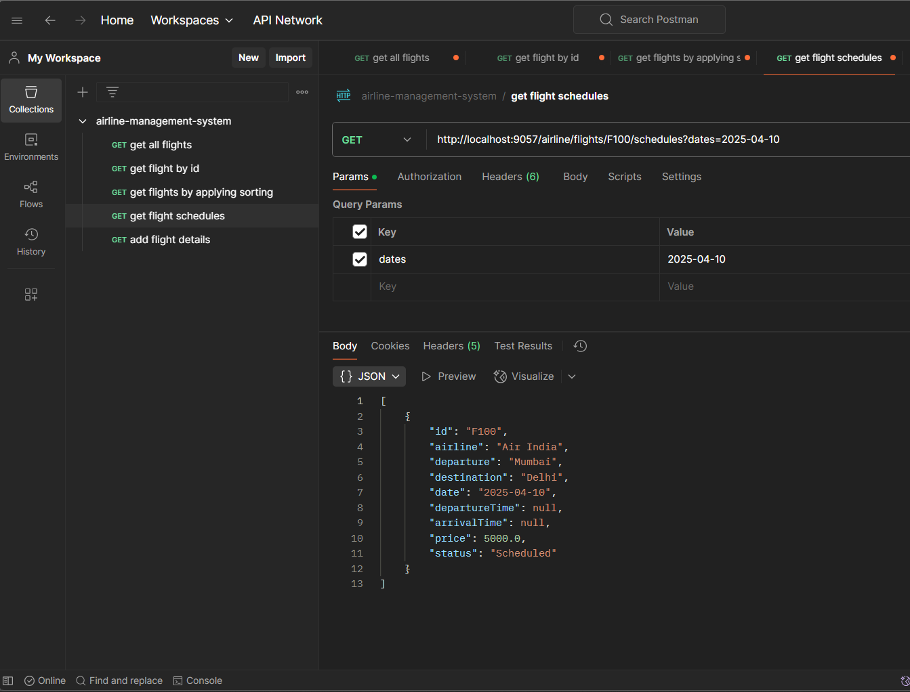
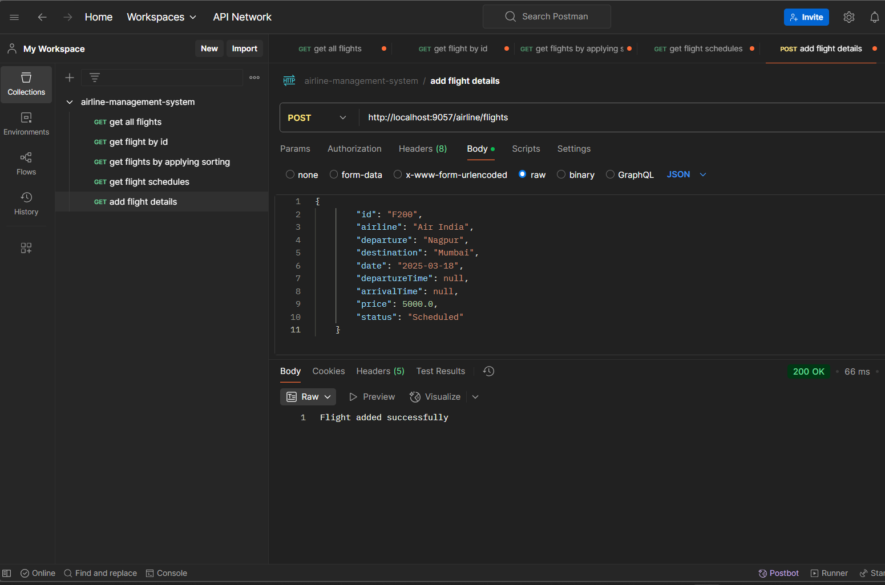
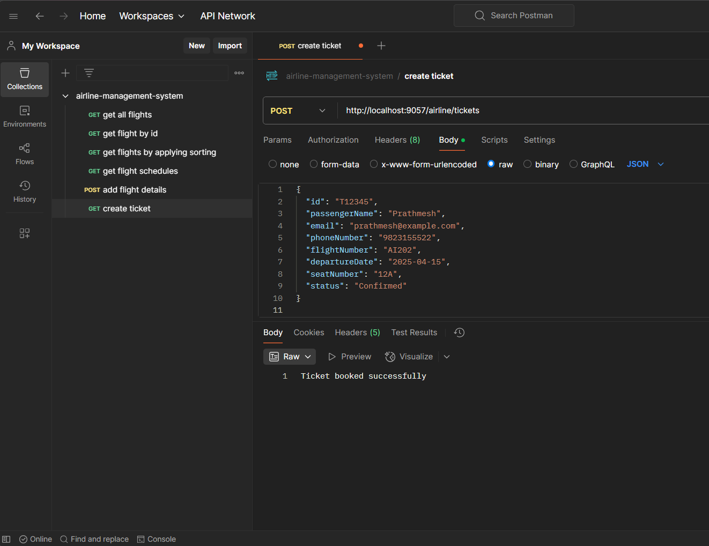
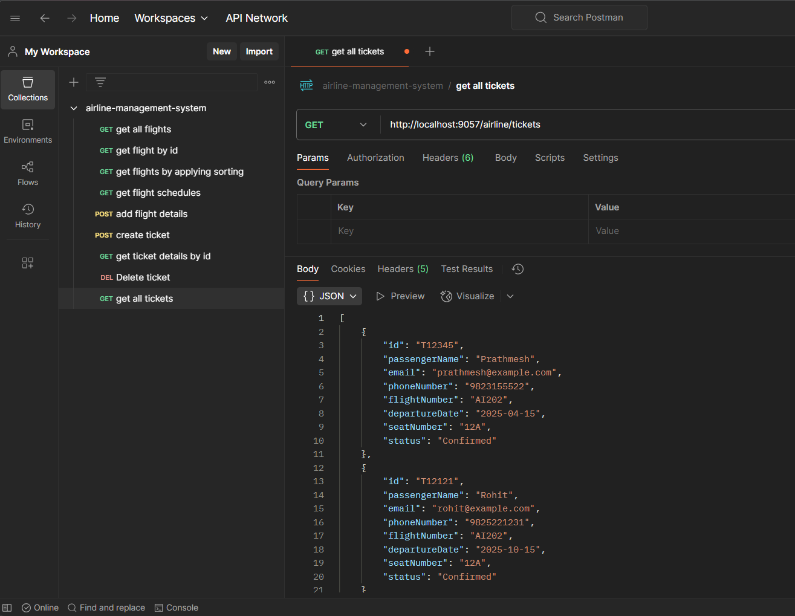
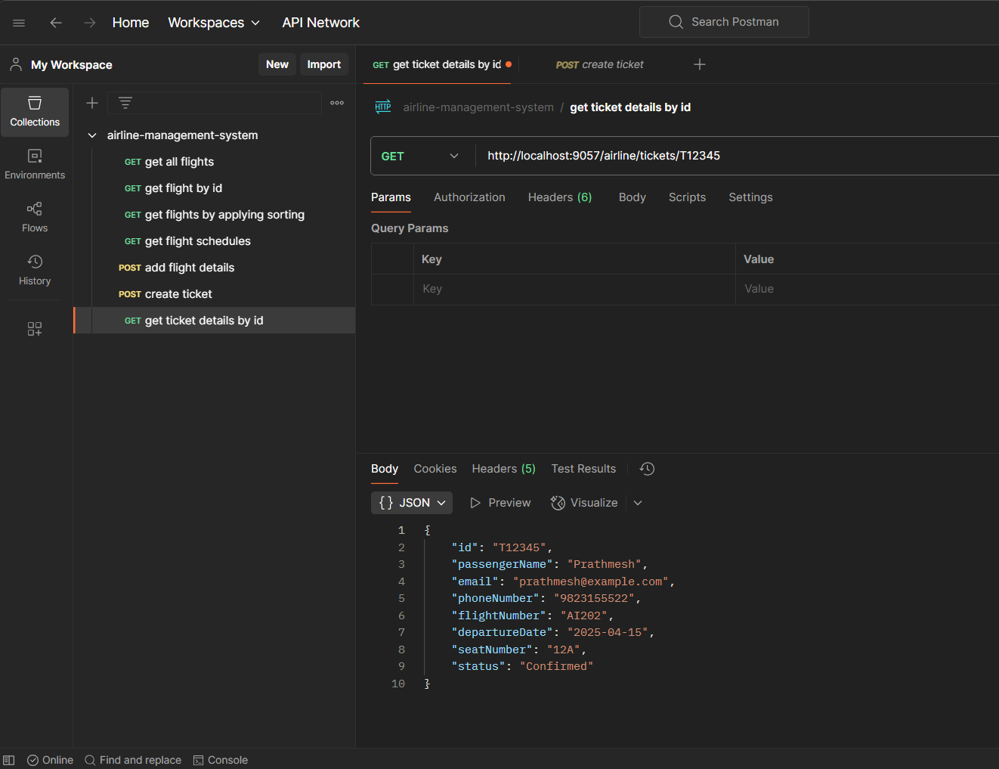
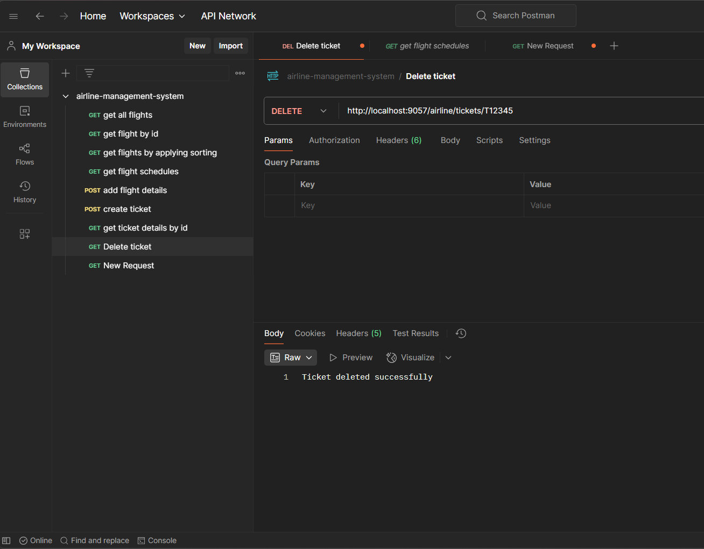

---

# ✈️ Airline Management System (Spring Boot + REST API)

## 📌 Overview  
This project is a **Spring Boot-based Airline Management System** that allows users to:  
- **View flight schedules**  
- **Book tickets**  
- **Retrieve ticket details**  
- **Cancel tickets**  
- **Ensure proper validation for duplicate bookings and errors**  

## 🚀 Tech Stack  
- **Spring Boot** (REST APIs)  
- **Java 23**  
- **Maven** (Dependency Management)  
- **Spring Web** (For creating RESTful endpoints)  
- **Lombok** (To reduce boilerplate code)  
- **Postman** (For API testing)  

## 🔧 Setup Instructions  
1. Clone the repository:  
   ```sh
   git clone https://github.com/Prathmesh2011/airline-management-system.git
   cd airline-management-system
   ```
2. Build and run the project using Maven:  
   ```sh
   mvn clean install
   ```
3. The application will start on `http://localhost:9057/airline`  

---

## 📌 API Endpoints  

### 1️⃣ **Get Flight Details**  
- **Endpoints:**  
  - `GET /flights`  
  - `GET /flights/{id}`  
  - `GET /flights?sort=asc|desc`  
- **Description:** Fetches all available flights sorted by departure time.  
- **Example Requests:**  
  ```http
  GET http://localhost:9057/airline/flights
  ```
  ```http
  GET http://localhost:9057/airline/flights/{id}
  ```
  ```http
  GET http://localhost:9057/airline/flights?sort=desc
  ```
- **Example Response:**  
  ```json
  [
    {
        "id": "F100",
        "airline": "Air India",
        "departure": "Mumbai",
        "destination": "Delhi",
        "date": "2025-04-10",
        "departureTime": null,
        "arrivalTime": null,
        "price": 5000.0,
        "status": "Scheduled"
    }
  ]
  ```
- **Screenshots:**  
    
    
    
    
    

---

### 2️⃣ **Get Flight Schedules by Date**  
- **Endpoint:** `GET /flights/{id}/schedules?dates=startDate`  
- **Example Request:**  
  ```http
  GET http://localhost:9057/airline/flights/F100/schedules?dates=2025-04-10
  ```
- **Screenshot:**  
    

---

### 3️⃣ **Create a Ticket (Book Flight)**  
- **Endpoint:** `POST /tickets`  
- **Example Request:**  
  ```http
  POST http://localhost:9057/airline/tickets
  ```
  ```json
  {
  "id": "T12345",
  "passengerName": "Prathmesh",
  "email": "prathmesh@example.com",
  "phoneNumber": "9823155522",
  "flightNumber": "AI202",
  "departureDate": "2025-04-15",
  "seatNumber": "12A",
  "status": "Confirmed"
  }
  ```
- **Screenshot:**  
    

---

### 4️⃣ **Get All Ticket Details**  
- **Endpoint:** `GET /tickets`  
- **Example Request:**  
  ```http
  GET http://localhost:9057/airline/tickets
  ```
- **Screenshot:**  
    

---

### 5️⃣ **Get Ticket Details By Id**  
- **Endpoint:** `GET /tickets/{id}`  
- **Example Request:**  
  ```http
  GET http://localhost:9057/airline/tickets/T12345
  ```
- **Screenshot:**  
    

---

### 6️⃣ **Cancel Ticket**  
- **Endpoint:** `DELETE /tickets/{id}`  
- **Example Request:**  
  ```http
  DELETE http://localhost:9057/airline/tickets/T12345
  ```
- **Screenshot:**  
    

---
